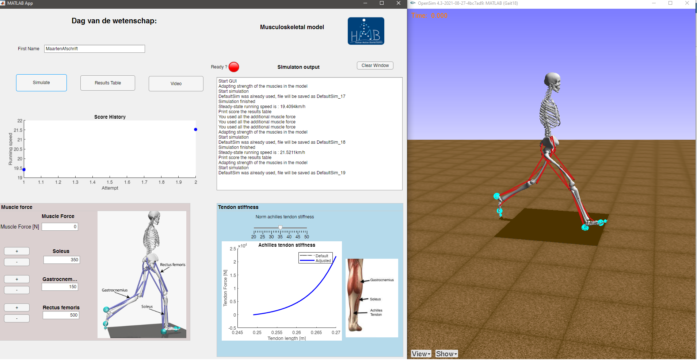

# Runner 2D

Optimize the running speed of your musculoskeletal model. Run the GUI (.App/OptSpeedRunner.mlapp or OptSpeedRunner_exported.m)

## Installation instruction

Requirements:

- Add the folder and subfolder Runner_2D to your matlab path (i.e. addpath(genpath(C:\Runner_2D)))
- Matlab (tested in 2020a on windows)
- Casadi API: We use casadi to formulate the optimal control problem. You can download casadi here (https://web.casadi.org/get/) and simply install it by adding the casadi folder to your matlab path.
- Opensim API: We use the Opensim API to read and write .osim file https://simtk-confluence.stanford.edu:8443/display/OpenSim/Scripting+with+Matlab (tested with opensim 4.3 )

## GUI

Overview of the graphical user interface. The goal is maximize the running speed. You have a bonus strength of 1000N to adjust the maximal isometric force of three muscles in the model (Soleus, Gastrocnemius and Rectus femoris). You can also adapt the normalized stiffness of the Achilles tendon.

## Background information

The running motion is predicted by solving an optimal control problem. We optimize the muscle excitations to maximize the running speed. We used a direct collocation approach to formulate the problem in Casadi and solve the resulting NLP in IPOPT.

Some additional information:

- Trapezoidal integration scheme
- Small term in objective function related to minimization of muscle activations squared and the controls in our simulation (to improve convergence). No tracking of experimental data.
- Assumed left-right symmetry which enables us to simulate half a gait cycle
- 1 contact sphere on calcaneus (heel) and two contact spheres on toes
- Used polynomials to approximate muscle-tendon-length and moment arms (see FitPolynomials)